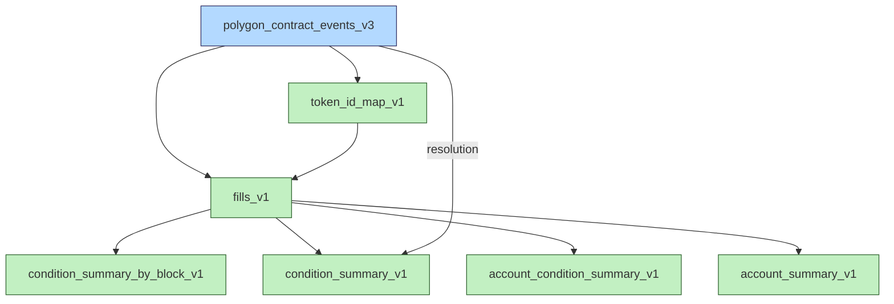

# Data catalog

This is the single source of truth for all datasets in this project.

**Base path:** configured via environment variables per dataset (see each producer's README).

## Dependency graph

**Legend:** blue = raw data, green = derived immutable (partitioned append-only, never rewritten)

## Data types

Data types are chosen carefully to make joining easy. Mirror the logical Parquet types from `polygon_contract_events_v3` exactly: `BLOB` is Parquet `BYTE_ARRAY` (variable length, no logical type) — never `FIXED_LEN_BYTE_ARRAY`. The full rule is in [data-storage-policies](../.github/instructions/data-storage-policies.md).

## Column naming conventions

These conventions apply to every dataset in this project. Individual data dictionaries follow them and do not redefine them.

- `gross_*` — nominal (pre-fee) amount; signed where the amount has a direction.
- `net_*` — amount after fees, or when a fee does not apply; signed where the amount has a direction.
- `matched_*` — market-wide volume: the sum across all fill legs divided by two (each matched fill has a maker side and a taker side, so dividing by two avoids double counting).
- `volume_*` — account-specific volume: the sum of the magnitudes of one account's own fill legs; never divided by two.
- `_count` suffix — a count.
- Grain columns are marked with `*` in each dictionary's schema table.

## Raw data

| Dataset | Path | Producer | Description | Dictionary | Sort order |
|---|---|---|---|---|---|
| polygon_contract_events_v3 | `$POLYGON_CONTRACT_EVENTS_V3_DIR` | [raw_data/polygon_contract_events_v3/](../raw_data/polygon_contract_events_v3/) | On-chain events from all Polymarket contracts on Polygon, scraped via JSON-RPC | [DATA_DICTIONARY.md](../raw_data/polygon_contract_events_v3/DATA_DICTIONARY.md) | `block_number, transaction_index, log_index` |

## Derived data

| Dataset | Path | Producer | Description | Inputs | Dictionary | Sort order |
|---|---|---|---|---|---|---|
| token_id_map_v1 | `$TOKEN_ID_MAP_V1_DIR` | [derived_data/token_id_map_v1/](../derived_data/token_id_map_v1/) | Lookup table: `token_id → (collateral_token, parent_collection_id, condition_id, index_set, market_id)` | polygon_contract_events_v3 | [DATA_DICTIONARY.md](../derived_data/token_id_map_v1/DATA_DICTIONARY.md) | `token_id` |
| fills_v1 | `$FILLS_V1_DIR` | [derived_data/fills_v1/](../derived_data/fills_v1/) | One row per account leg of every `order_filled` event, with signed USDC and condition-token amounts, condition/market enrichment, and a running per-account YES position | polygon_contract_events_v3, token_id_map_v1 | [DATA_DICTIONARY.md](../derived_data/fills_v1/DATA_DICTIONARY.md) | `block_number, logical_fill_index` |
| condition_summary_by_block_v1 | `$CONDITION_SUMMARY_BY_BLOCK_V1_DIR` | [derived_data/condition_summary_by_block_v1/](../derived_data/condition_summary_by_block_v1/) | Per-block OHLC YES price and market-wide matched volume and fees for each condition | fills_v1 | [DATA_DICTIONARY.md](../derived_data/condition_summary_by_block_v1/DATA_DICTIONARY.md) | `block_number, condition_id` |
| condition_summary_v1 | `$CONDITION_SUMMARY_V1_DIR` | [derived_data/condition_summary_v1/](../derived_data/condition_summary_v1/) | Per-partition OHLC YES price, market-wide matched volume, and resolution outcome for each condition | fills_v1, polygon_contract_events_v3 | [DATA_DICTIONARY.md](../derived_data/condition_summary_v1/DATA_DICTIONARY.md) | `condition_id` |
| account_condition_summary_v1 | `$ACCOUNT_CONDITION_SUMMARY_V1_DIR` | [derived_data/account_condition_summary_v1/](../derived_data/account_condition_summary_v1/) | Per-partition summary of how one account traded one condition: fill count, account-specific volume, fees, timing | fills_v1 | [DATA_DICTIONARY.md](../derived_data/account_condition_summary_v1/DATA_DICTIONARY.md) | `account, condition_id` |
| account_summary_v1 | `$ACCOUNT_SUMMARY_V1_DIR` | [derived_data/account_summary_v1/](../derived_data/account_summary_v1/) | Per-partition behavioral profile for each account: fill count, condition breadth, volume, fees, timing, and entropy metrics | fills_v1 | [DATA_DICTIONARY.md](../derived_data/account_summary_v1/DATA_DICTIONARY.md) | `account` |

## Adding a new dataset

1. Add a row to the appropriate table above (including inputs and sort order).
2. Create a `DATA_DICTIONARY.md` alongside the producer script.
3. Follow the partitioning, naming, metadata, and sorting rules in [data-storage-policies](../.github/instructions/data-storage-policies.md).
