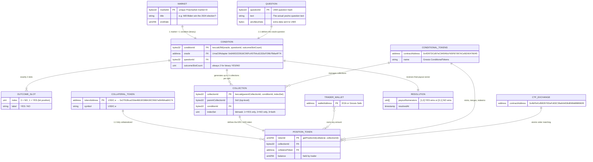

# All Polymarket transactions (trader actions & blockchain events)

## Library of entities (all on Polygon mainnet, chain ID 137)

### Contracts that traders interact with

- `TRADER_WALLET` (various addresses)
  EOA or smart-contract wallet (e.g. Gnosis Safe) controlled by someone making trades
- `USDC.e` `ERC20 0x2791Bca1f2de4661ED88A30C99A7a9449Aa84174`
  a USDC wrapper used in all markets
- `ConditionalTokens` ("CTF") `ERC1155 0x4D97DCd97eC945f40cF65F87097ACe5EA0476045`
  a public utility deployed by Gnosis core ERC-1155 contract used for for Polymarket and other prediction markets
- `WrappedCollateral` `ERC20 0x3A3BD7bb9528E159577F7C2e685CC81A765002E2`
  an internal token used by the `NegRiskAdapter` (not binary markets)

### Contracts that only the admin / oracle interact with

- `CTFExchange` `0x4bFb41d5B3570DeFd03C39a9A4D8dE6Bd8B8982E`
  Polymarket's order-book exchange contract for trading CTF positions
- `NegRiskCTFExchange` `0xC5d563A36AE78145C45a50134d48A1215220f80a`
  Polymarket's order-book matching contract for trading NegRisk markets
- `NegRiskAdapter` `0xd91E80cF2E7be2e162c6513ceD06f1dD0dA35296`
  Polymarket's wrapper over CTF for a group of conditions with the normal use case that only one is a "YES". the main contract used for every NegRisk market position action, wrapping calls to CTF and handling collateral

### Fee module contracts

- `FeeModule` `0xE3f18aCc55091e2c48d883fc8C8413319d4Ab7b0`
  processes fee refunds for CTFExchange trades
- `NegRiskFeeModule` `0xB768891e3130F6dF18214Ac804d4DB76c2C37730`
  processes fee refunds for NegRiskCTFExchange trades
  
## Approvals

A trader must approve their `USDC.e` and `ConditionalTokens` each to the `CTFExchange`, `NegRiskCTFExchange` and `NegRiskAdapter` to use the off-chain orderbook.

## Binary market actions (not including NegRisk markets)



The Polymarket admin creates a new binary market (two outcomes) and these events are emitted:

- `emit ConditionalTokens.ConditionPreparation(bytes32 conditionId, address oracle, bytes32 questionId, uint outcomeSlotCount)`
  - `conditionId` is duplicative, you can generate it from (`oracle`, `questionId`, `outcomeSlotCount`)
  - you can deterministically calculate the tokenIds (there are `outcomeSlotCount` of them)

Any trader can split their collateral into positions and merge them back, this is where the condition tokens come from:

- `emit ConditionalTokens.PositionSplit(address stakeholder, IERC20 collateralToken, bytes32 parentCollectionId, bytes32 conditionId, uint[] partition, uint amount)`
- `emit ConditionalTokens.PositionsMerge(address stakeholder, IERC20 collateralToken, bytes32 parentCollectionId, bytes32 conditionId, uint[] partition, uint amount)`
  - the `stakeholder` is the trader
  - the `collateralToken` is always USDC.e
  - the `parentCollectionId` is always 0x0 for binary markets
  - the `conditionId` identifies the market question
  - the `partition` always represents a split to a YES and NO token `[1, 2]`
  - the `amount` is how much collateral is used

And when they are not merged, here is what emits when a trade happens:

- `emit CTFExchange.OrderFilled(bytes32 orderHash, address maker, address taker, uint256 makerTokenId, uint256 takerTokenId, uint256 amountOfMakerToken, uint256 amountOfTakerToken, uint256 feeAmount)`
  - emitted by `CTFExchange` when a trade is executed against the off-chain order book
  - the `makerTokenId` identifies the specific position token the maker is offering
  - the `takerTokenId` identifies the specific position token the taker is offering
  - the `amountOfMakerToken` is how many position tokens the maker is selling
  - the `amountOfTakerToken` is how many position tokens the taker is selling
  - **the `feeAmount` is the GROSS fee initially taken — NOT the actual fee paid.** the fee module refunds most of it back, see below.

- `emit FeeModule.FeeRefunded(bytes32 orderHash, address to, uint256 id, uint256 refund, uint256 feeCharged)`
  - emitted by `FeeModule` (`0xE3f18aCc...`) after each `OrderFilled`
  - `orderHash` matches the `OrderFilled` for this leg (1:1 join key)
  - `refund` is the amount returned to the trader
  - `feeCharged` is the **actual net fee retained** (this is what the trader really paid)
  - invariant: `refund + feeCharged = feeAmount` from the corresponding `OrderFilled`
  - makers typically have `feeCharged = 0` (100% refund)
  - takers pay ~1.35% of their fill (Polymarket's advertised rate), but the gross `feeAmount` in `OrderFilled` is ~10% — a ~7.5x overstatement

**Which markets charge fees:** not all markets charge fees. Polymarket only charges taker fees on **crypto price markets** (Bitcoin/Ethereum/Solana up-or-down) and **certain sporting events**. Most markets — politics, geopolitics, entertainment, general prediction — have `feeAmount = 0` in `OrderFilled` and emit no `FeeRefunded` event at all. On-chain, this is a per-condition binary property: every fill within a condition is either always fee-charging or always fee-free (no mixed conditions observed).

**How to detect whether a market charges fees:**

| Method | When to use | How |
|---|---|---|
| CLOB API (`/fee-rate`) | **Production** — before placing an order | `GET {CLOB_API_URL}/fee-rate?token_id={clob_token_id}` → returns `{"base_fee": 135}` for fee-charging markets or `{"base_fee": 0}` for fee-free markets. The `py_clob_client` library calls this automatically via `client.get_fee_rate_bps(token_id)` and caches the result. |
| Gamma API (`/markets`) | **Production** — when browsing/filtering markets | Each market object has `feesEnabled` (boolean) and `feeType` (string or null). |
| `OrderFilled.fee` | **Backtesting** — from on-chain historical data | If `fee = 0` on any fill for a condition, the entire condition is fee-free. If `fee > 0`, it charges fees. See `analysis/fees/analyze_fees.py`. |

The fee rate is baked into each signed order via `Order.feeRateBps`. The CLOB API tells the client what value to use for each token. The exchange contract caps this at 1000 bps (10%), but the FeeModule refunds down to the actual rate (~135 bps for takers, 0 for makers).

- `emit CTFExchange.OrdersMatched(bytes32 orderHash, address maker, uint256 makerTokenId, uint256 takerTokenId, uint256 amountOfMakerToken, uint256 amountOfTakerToken)`
  - emitted by `CTFExchange` when a trade ...
  - matches one taker order against one or more maker orders in the order book
  - all trade information in `OrdersMatched` is duplicative of what's in `OrderFilled` and the `OrdersMatched` also doesn't even tell you who the counterparties are

Trades through the exchange can only happen from `fillOrder`, `fillOrders` or `matchOrders`.

| Order action                                         | Emits `OrderFilled`                                          | Emits `OrdersMatched` |
| ---------------------------------------------------- | ------------------------------------------------------------ | --------------------- |
| `fillOrder()` with `msg.sender` as taker             | One emitted, maker and taker are the benificial participants | None emitted          |
| `fillOrders` with `msg.sender` as taker              | One emitted per order, maker and taker are the beneficial participants | None emitted          |
| `matchOrders` signed maker and taker orders attached | One taker order and one or more maker orders, each order has the exchange itself as a either a maker or taker participant but the exchange actions sum to zero | One emitted           |

Therefore if you need to track every trade, use `OrderFilled`, not `OrdersMatched` and ignore the legs of each fill where the "counterparty" is the marketplace itself.

And then to resolve:

- `emit ConditionalTokens.ConditionResolution(bytes32 conditionId, address oracle, bytes32 questionId, uint outcomeSlotCount, uint[] payoutNumerators)`
  - the oracle reports the market outcome and the condition is resolved
  - `conditionId` is duplicative, you can generate it from (`oracle`, `questionId`, `outcomeSlotCount`)
  - the `payoutNumerators` are `[1,0]` (YES wins) or `[0,1]` (NO wins) for binary markets, or exception outcomes like `[1,1]`

After resolution, we can see redemptions:

- `emit ConditionalTokens.PayoutRedemption(address redeemer, IERC20 collateralToken, bytes32 parentCollectionId, bytes32 conditionId, uint[] indexSets, uint payout)`
  - the `redeemer` is the trader redeeming their winning position tokens for collateral
  - the `collateralToken` is always USDC.e for Polymarket binary markets
  - the `parentCollectionId` is always 0x0 for binary markets
  - the `conditionId` identifies the market question
  - the `indexSets` is which positions are being redeemed (e.g. `[1]` for YES or `[2]` for NO)
  - the `payout` is how much collateral they receive based on the resolution (e.g. if they redeemed 10 YES tokens and YES won, they get 10 USDC.e → payout = 10000000)

## NegRisk market actions

```mermaid
erDiagram
    %% Gnosis Conditional Tokens Framework wrapped by NegRiskAdapter for multi-outcome markets
    %% (only one outcome resolves to YES; all others to NO; capital-efficient via conversion)
    MARKET ||--|{ CONDITION : "1 market = N binary conditions (one per outcome)"
    MARKET {
        bytes32 marketId PK "unique Polymarket NegRisk market ID (groups outcomes)"
        string title "e.g. Who will win the 2024 Presidential Election?"
        uint256 endDate
        bool negRisk "always true"
    }
    QUESTION ||--|| CONDITION : "1:1 defines the oracle question per outcome"
    QUESTION {
        bytes32 questionId PK "UMA question hash per outcome"
        string text "e.g. Will Trump win?"
        bytes ancillaryData "extra data sent to UMA"
    }
    CONDITION {
        bytes32 conditionId PK "keccak256(oracle, questionId, 2)"
        address oracle FK "UmaCtfAdapter 0x6A9D222616C90FcA5754cd1333cFD9b7fb6a4F74"
        bytes32 questionId FK
        uint outcomeSlotCount "always 2 for binary YES/NO"
        bytes32 marketId FK "links to parent NegRisk market"
    }
    CONDITION ||--|{ OUTCOME_SLOT : "exactly 2 slots per condition"
    OUTCOME_SLOT {
        uint index "0 = NO, 1 = YES"
        string label "YES / NO"
    }
    CONDITION ||--o{ COLLECTION : "generates collections per split"
    COLLECTION {
        bytes32 collectionId PK "keccak(parentCollectionId, conditionId, indexSet)"
        bytes32 parentCollectionId "0x0 (top-level)"
        bytes32 conditionId FK
        uint indexSet "bitmask: 1=YES only, 2=NO only, 3=both"
    }
    WRAPPED_COLLATERAL ||--o{ POSITION_TOKEN : "internal collateral wrapper"
    WRAPPED_COLLATERAL {
        address tokenAddress PK "0x3A3BD7bb9528E159577F7C2e685CC81A765002E2"
        string symbol "WrappedCollateral"
    }
    COLLECTION ||--|| POSITION_TOKEN : "defines the ERC-1155 token (via CTF)"
    POSITION_TOKEN {
        uint256 tokenId PK "getPositionId(wrappedCollateral, collectionId)"
        bytes32 collectionId FK
        address collateralToken FK "always WrappedCollateral"
        uint256 balance "held by trader"
    }
    TRADER_WALLET }o--o{ POSITION_TOKEN : "owns any amount"
    TRADER_WALLET {
        address walletAddress PK "EOA or Gnosis Safe"
    }
    %% Resolution (only ONE condition resolves YES)
    CONDITION ||--|| RESOLUTION : "receives final payout vector"
    RESOLUTION {
        uint[] payoutNumerators "[1,0] YES wins or [0,1] NO wins (exactly one YES across market)"
        timestamp resolvedAt
    }
    %% Core contracts
    CONDITIONAL_TOKENS ||--o{ POSITION_TOKEN : "mints, merges, redeems (called via adapter)"
    CONDITIONAL_TOKENS {
        address contractAddress "0x4D97DCd97eC945f40cF65F87097ACe5EA0476045"
        string name "Gnosis ConditionalTokens"
    }
    NEGRISK_ADAPTER ||--o{ POSITION_TOKEN : "trader-facing wrapper (split/merge/convert/redeem)"
    NEGRISK_ADAPTER {
        address contractAddress "0xd91E80cF2E7be2e162c6513ceD06f1dD0dA35296"
        string name "Polymarket NegRiskAdapter"
    }
    %% Trading (NegRisk only)
    NEGRISK_CTF_EXCHANGE ||--o{ POSITION_TOKEN : "atomic order matching"
    NEGRISK_CTF_EXCHANGE {
        address contractAddress "0xC5d563A36AE78145C45a50134d48A1215220f80a"
    }
```



The Polymarket admin creates a new NegRisk market (multiple outcomes, exactly one winner) and these events are emitted:

- `emit NegRiskAdapter.MarketPrepared(bytes32 marketId, address oracle, uint256 feeBips, bytes data)`
- `emit NegRiskAdapter.QuestionPrepared(bytes32 marketId, bytes32 questionId, uint256 index, bytes data)` (one per outcome)
  - additionally emits `ConditionalTokens.ConditionPreparation(...)` on the underlying CTF for each binary condition
  - `marketId` groups all conditions of the event
  - you can deterministically calculate the tokenIds for all YES/NO positions

Any trader can split their collateral into positions (or merge them back) **through the NegRiskAdapter** (which internally uses WrappedCollateral and forwards to CTF):

- `emit NegRiskAdapter.PositionSplit(address stakeholder, bytes32 conditionId, uint256 amount)`
  - (also emits the underlying `ConditionalTokens.PositionSplit` with `collateralToken = WrappedCollateral`)
- `emit NegRiskAdapter.PositionsMerge(address stakeholder, bytes32 conditionId, uint256 amount)`
  - (also emits the underlying `ConditionalTokens.PositionsMerge`)
  - the `stakeholder` is the trader
  - the `conditionId` identifies one specific outcome's binary market
  - the `amount` is how much collateral/position is used

**Conversion** (the defining NegRisk feature — turns a NO on one outcome into YES on every other outcome):

- `emit NegRiskAdapter.PositionsConverted(address stakeholder, bytes32 marketId, uint256 indexSet, uint256 amount)`
  - atomic operation on the adapter
  - consumes NO tokens on selected outcomes and mints equivalent YES tokens on all others (releasing collateral as needed via WrappedCollateral)

When they are not merged or converted, here is what emits when a trade happens (via the off-chain order book):

- `emit NegRiskCTFExchange.OrderFilled(bytes32 orderHash, address maker, address taker, uint256 makerTokenId, uint256 takerTokenId, uint256 amountOfMakerToken, uint256 amountOfTakerToken, uint256 feeAmount)`
  - emitted by `NegRiskCTFExchange` when a trade is executed
  - identical semantics to the binary `CTFExchange.OrderFilled`
  - `makerTokenId` / `takerTokenId` are CTF position token IDs (YES or NO of a specific outcome)
  - **the `feeAmount` is the GROSS fee — the actual net fee is in the subsequent `FeeRefunded` event** (see below)

- `emit NegRiskFeeModule.FeeRefunded(bytes32 orderHash, address to, uint256 id, uint256 refund, uint256 feeCharged)`
  - emitted by `NegRiskFeeModule` (`0xB768891e...`) after each NegRisk `OrderFilled`
  - identical schema and semantics to the binary `FeeModule.FeeRefunded` described above
  - 1:1 with `OrderFilled` via `orderHash`
  - same fee applicability rules as binary markets: only crypto price markets and certain sporting events charge fees; most NegRisk conditions (political multi-outcome markets, etc.) are fee-free

- `emit NegRiskCTFExchange.OrdersMatched(...)`
  - same guidance as binary: track `OrderFilled` only; ignore marketplace legs in `OrdersMatched`

Trades through the exchange can only happen from `fillOrder`, `fillOrders` or `matchOrders` (identical rules and table as binary markets, just using `NegRiskCTFExchange` address).

| Order action                                         | Emits `OrderFilled`                                          | Emits `OrdersMatched` |
| ---------------------------------------------------- | ------------------------------------------------------------ | --------------------- |
| `fillOrder()` with `msg.sender` as taker             | One emitted, maker and taker are the beneficial participants | None emitted          |
| `fillOrders` with `msg.sender` as taker              | One emitted per order, maker and taker are the beneficial participants | None emitted          |
| `matchOrders` signed maker and taker orders attached | One taker order and one or more maker orders, each order has the exchange itself as a either a maker or taker participant but the exchange actions sum to zero | One emitted           |

And then to resolve (exactly one outcome YES across the entire market):

- `emit NegRiskAdapter.OutcomeReported(bytes32 marketId, bytes32 questionId, bool outcome)`
- `emit ConditionalTokens.ConditionResolution(...)` (one per resolved condition on CTF)
  - the oracle reports per-question outcomes; the adapter ensures market integrity (only one YES total)

After resolution, we can see redemptions (via the adapter):

- `emit NegRiskAdapter.PayoutRedemption(address redeemer, bytes32 conditionId, uint256[] amounts, uint256 payout)`
  - the `redeemer` is the trader
  - the `conditionId` identifies the winning outcome's binary condition
  - the `payout` is how much WrappedCollateral (ultimately convertible to USDC.e) they receive
  - winning YES positions redeem 1:1; all NO positions are worthless

## V2 exchange actions (CTFExchangeV2 and NegRiskCtfExchangeV2)

The v2 exchanges (`CTFExchangeV2` at `0xE111180000d2663C0091e4f400237545B87B996B` and `NegRiskCtfExchangeV2` at `0xe2222d279d744050d28e00520010520000310F59`) replace the separate maker/taker asset IDs with a single `tokenId` plus a `side` flag, and they have no FeeModule — the fee in `OrderFilled` is always the final net fee paid, with no refund event.

### Order semantics

Each signed order carries a nominal rate in its `makerAmount` and `takerAmount` fields: "I will give up at most `makerAmount` of my asset and receive at least `takerAmount` of the other." These are the limits the trader authorizes, not the amounts the contract necessarily transfers. The contract computes how much is actually filled (which may be a partial fill) via:

```
takingAmount = (makingAmount × order.takerAmount) / order.makerAmount
```

The values emitted in the event reflect only what was actually filled, not the full order size.

### `order_filled` event fields and net amounts

`emit CTFExchangeV2.OrderFilled(bytes32 orderHash, address maker, address taker, uint8 side, uint256 tokenId, uint256 makerAmountFilled, uint256 takerAmountFilled, uint256 fee, bytes32 builder, bytes32 metadata)`

- `side = 0` (BUY): the order maker is buying outcome tokens with USDC
- `side = 1` (SELL): the order maker is selling outcome tokens for USDC
- `fee` is always in USDC (the collateral), regardless of side — confirmed by `AssetOperations._transfer`, which routes asset ID `0` to `_transferCollateral` for every fee transfer

The net amounts actually received by each party are:

| side | tokens transferred to maker | USDC transferred to maker |
|---|---|---|
| BUY | `takerAmountFilled` tokens received | `makerAmountFilled + fee` USDC sent |
| SELL | `makerAmountFilled` tokens sent | `takerAmountFilled − fee` USDC received |

In other words, for a BUY order the fee is an additional outflow on top of `makerAmountFilled`, and for a SELL order the fee is deducted from `takerAmountFilled` before the proceeds are remitted.

### Why a symmetric pair of orders produces unequal filled amounts

When Alice (SELL) and Bob (BUY) are a perfectly symmetric complementary match — each the exact mirror of the other at the same price — the nominal USDC value of the trade is the same for both. But the filled amounts in the two `order_filled` rows will differ whenever a fee applies:

**Example:** 10 outcome tokens at $0.50 each = $5 USDC nominal; 10% fee (500 bps) = $0.50 USDC per party.

| event | `maker` | `side` | `makerAmountFilled` | `takerAmountFilled` | `fee` |
|---|---|---|---|---|---|
| `order_filled` for Alice | Alice | 1 (SELL) | 10 tokens | 5 USDC | 0.5 USDC |
| `order_filled` for Bob | Bob | 0 (BUY) | 5 USDC | 10 tokens | 0.5 USDC |

Alice actually receives `5 − 0.5 = 4.5 USDC`. Bob actually sends `5 + 0.5 = 5.5 USDC`. The 1.0 USDC total fee is collected in a separate `fee_charged` transfer. The `makerAmountFilled` on Alice's row (10) equals the `takerAmountFilled` on Bob's row (10) because the token leg is fee-free, but the USDC legs are asymmetric: 5 on Alice's row versus 5 on Bob's row, with both rows carrying a `fee` of 0.5.

A consumer that wants the true economic flow must apply:
- **net USDC received by a SELL maker** = `takerAmountFilled − fee`
- **net USDC paid by a BUY maker** = `makerAmountFilled + fee`

### `orders_matched` and `fee_charged`

- `emit CTFExchangeV2.OrdersMatched(...)` — one per `matchOrders` call; aggregates the taker's view (no `fee` field); contains no information not already in the corresponding `order_filled` rows. Track `order_filled`, not `orders_matched`.
- `emit CTFExchangeV2.FeeCharged(address receiver, uint256 amount)` — one emission per fee-bearing leg (one for each of the maker and the taker when both pay a fee). The `amount` is in USDC. There is no `token_id` field (unlike v1 `FeeCharged`). The sum of all `fee_charged.amount` values in a transaction equals the sum of all `order_filled.fee` values in the same transaction.

Unlike v1, there is no FeeModule and no `fee_refunded` event — the `fee` in each `order_filled` is the final amount collected.
