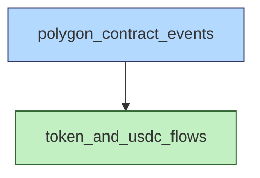

# Data catalog

This is the single source of truth for all datasets in this project.

**Base path:** `/Volumes/polymarket-quant-desk/`

## Dependency graph

**Legend:** blue = raw data, green = derived immutable, orange = derived mutable (regenerated from scratch)

## Data types

Data types are chosen carefully to make joining easy. See the logical Parquet types in `polygon_contract_events` as a starting point. Mirror them exactly: `BLOB` is Parquet `BYTE_ARRAY` (variable length, no logical type) — never `FIXED_LEN_BYTE_ARRAY`. The full rule is in [data-storage-policies](../.github/instructions/data-storage-policies.md).

## Raw data

| Dataset | Path | Producer | Mutability | Description | Dictionary | Sort order |
|---|---|---|---|---|---|---|
| polygon_contract_events | `raw_data/cold/polygon_contract_events_v2/` | [raw_data/polygon_contract_events_v2/](../../raw_data/polygon_contract_events_v2/) | partitioned append-only | On-chain events from Polymarket contracts | [DATA_DICTIONARY.md](../../raw_data/polygon_contract_events_v2/DATA_DICTIONARY.md) | `block_number, transaction_index, log_index` |

## Derived data

| Dataset | Path | Producer | Mutability | Description | Inputs | Dictionary | Sort order |
|---|---|---|---|---|---|---|---|
| token_and_usdc_flows | `derived_data/token_and_usdc_flows_v2/…` | [materialize.py](../../derived_data/token_and_usdc_flows/materialize.py) | partitioned append-only | Per-account, per-event USDC and outcome-token movements across all Polymarket operations | polygon_contract_events | [DATA_DICTIONARY.md](../../derived_data/token_and_usdc_flows/DATA_DICTIONARY.md) | `block_number, log_index, sub_index` |

## Adding a new dataset

1. Add a row to the appropriate table above (including `Producer`, `Mutability`, and `Sort order`)
2. Create a `DATA_DICTIONARY.md` alongside the materializer script
3. Follow the partitioning, naming, metadata, and sorting rules in [data-storage-policies](../.github/instructions/data-storage-policies.md)
