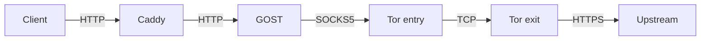

# exchange_client

This folder is responsible for getting live data from the market and sending actionable trade orders to the market.

This folder has three responsibilities:

1. **Proxy** — routes all Polymarket API traffic through Tor so the origin IP is hidden and geographic restrictions are bypassed.
2. **Trading library** (`trading_lib.py`) — shared module for building a CLOB client, fetching positions, placing market orders, and logging trades. Imported by bots and other scripts across the repo.
3. **CLI programs** — `positions_and_orders.py` and `buy-market.py` for interactive use.

## One-time setup

```sh
brew install tor gost caddy
python3 -m venv .venv
source .venv/bin/activate
pip install -r requirements.txt
```

Copy `.env.example` (or create `.env`) with the required variables — see below.

# Same snapshot, but using Polynode for positions and Polygon RPC for balances

Activate the venv, then start the proxy:

Notes:

- `--execution-client clob` uses the local proxy-backed Polymarket data/CLOB APIs.
- `--execution-client polynode` uses the Polynode REST API for positions and Polygon RPC for balances.
- Open-order queries are currently only implemented in `clob` mode.

```sh
source .venv/bin/activate
python3 start_proxy.py
```

This launches Tor, GOST, and Caddy, waits for the proxy to become ready, prints the IP address seen by httpbin.org, then keeps running until you press Ctrl+C.

To start each service manually in separate terminals instead:

```sh
# Terminal 1 — Tor
cd proxy-config && tor -f ./config.torrc --runasdaemon 0

# Terminal 2 — GOST
cd proxy-config && gost -C gost.yaml

# Terminal 3 — Caddy
cd proxy-config && caddy run --config Caddyfile
```

## Usage and testing

Access httpbin.org to confirm it does not see your local IP address:

```sh
# Local IP address
curl https://httpbin.org/ip
# Proxied IP address
curl http://localhost:9430/ip
```

As per the [Caddyfile](proxy-config/Caddyfile) and [GOST config](proxy-config/gost.yaml), the following local ports are available:

- `http://localhost:9430` → `http://httpbin.org:80`
- `http://localhost:9431` → `https://clob.polymarket.com:443`
- `http://localhost:9432` → `https://gamma-api.polymarket.com:443`
- `http://localhost:9433` → `https://data-api.polymarket.com:443`

## How it works



## Stop

If using `start_proxy.py`, press Ctrl+C — all three services are terminated automatically.

If running manually:

```sh
pkill tor; pkill gost; pkill caddy
```

## Trading library

`trading_lib.py` is the shared module imported by all scripts in this folder and by bots in `purple-moose/`. Key functions:

| Function | Description |
|---|---|
| `build_client()` | Constructs an authenticated `ClobClient` from environment variables |
| `get_funder_address()` | Returns the proxy wallet address |
| `get_usdc_balance(client)` | Returns spendable USDC balance in dollars |
| `get_book_spread(client, token_id)` | Fetches spread, midpoint, best bid/ask for a token |
| `fetch_positions(user)` | Fetches open (and optionally redeemable) positions from the data API |
| `buy_token(client, token_id, amount)` | Places a fill-or-kill market buy order |
| `sell_token(client, token_id, size)` | Places a fill-or-kill market sell order |
| `cancel_all_orders(client)` | Cancels all open CLOB orders |
| `dump_all_positions(client, user)` | Sells all open positions at market price |
| `log_event(event)` | Appends a JSON line to the current session's trading log in `trading-logs/` |
| `require_env(name)` | Reads a required env var or exits with a clear error message |

All orders are logged to `../trading-logs/` as timestamped JSONL files, with both a `submitted` and `completed`/`failed` entry per order.

## CLI programs

With the proxy running and the venv active:

```sh
# Show positions and open orders
python3 positions_and_orders.py --execution-client clob

# Same read-only snapshot, but explicitly in polynode backend mode
python3 positions_and_orders.py --execution-client polynode

# Buy shares
python3 buy-market.py <tokenID> <amount>
```

## Environment variables

Required in `.env`:

| Variable | Description |
|---|---|
| `DATA_API_URL` | Data API base URL (e.g. `http://localhost:9433`) |
| `CLOB_API_URL` | CLOB API base URL (e.g. `http://localhost:9431`) |
| `EOA_PRIVATE_KEY` | Signer private key |
| `CLOB_API_KEY` | CLOB API key |
| `CLOB_SECRET` | CLOB API secret |
| `CLOB_PASS_PHRASE` | CLOB API passphrase |
| `POLYMARKET_PROXY_WALLET` | Proxy wallet (funder) address |
